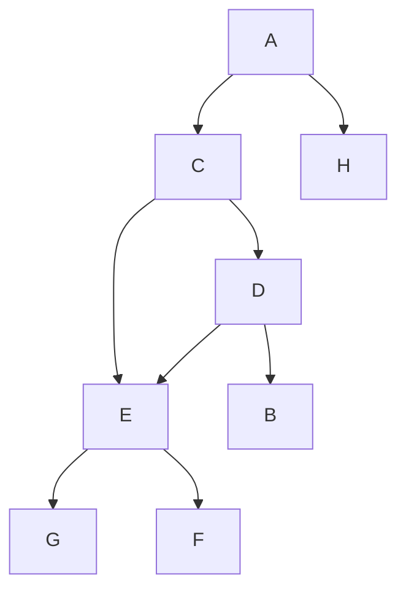

# Structures de données / Langage C
[Eléments sur le déroulement du semestre](https://github.com/truillet/upssitech/blob/master/CUPGE/L2/SDD/Cours/infos_L2CUPGE_UPSSITECH.pdf) (2024)

## Cours
* [Eléments introductifs sur les structures de données](https://github.com/truillet/upssitech/blob/master/CUPGE/L2/SDD/Cours/introduction_SdD.pdf) (2023)
* [enum, union et typedef en langage C](https://github.com/truillet/upssitech/blob/master/CUPGE/L2/SDD/Cours/types_avances_C.pdf) (2023)

### Quelques liens 

* D. Ritchie, [The Development of the C Language](https://dl.acm.org/doi/10.1145/155360.155580), ACM SIGPLAN Notices, Volume 28, n° 3, March 1993, pp. 201-208
* [Quick and Dirty Guide to C](https://courses.cs.washington.edu/courses/cse351/14sp/sections/1/Cheatsheet-c.pdf)
* [Pointer Cheat Sheet](https://c-for-dummies.com/caio/pointer-cheatsheet.php)
* [Installer le sous-sytème ubuntu sous windows](https://learn.microsoft.com/fr-fr/windows/wsl/install)
* [Serveur X et WSL2 sous Windows 10](https://medium.com/javarevisited/using-wsl-2-with-x-server-linux-on-windows-a372263533c3)

```
# sous WSL 2 et windows 11, un serveur X est installé [Magic] ! 
# sous WSL 2 et windows 10, lancer d'abord un serveur X comme VcXsrv
# (N'oubliez pas de cliquer sur l'option "Disable access control")
# définir les variables d'environnement DISPLAY et LIBGL_ALWAYS_INDIRECT (à mettre dans le fichier .bashrc)
export DISPLAY=$(awk '/nameserver / {print $2; exit}' /etc/resolv.conf 2>/dev/null):0
export LIBGL_ALWAYS_INDIRECT=1
```

* [git et VSCode](https://code.visualstudio.com/docs/sourcecontrol/overview) et [git cheat sheet](https://github.github.com/training-kit/downloads/github-git-cheat-sheet.pdf)
* Le concours de code C obscur : **[The International Obfuscated C Code Contest](https://www.ioccc.org)**
  
## Travaux Pratiques

* **TP 1** : [prise en main](https://github.com/truillet/upssitech/blob/master/CUPGE/L2/SDD/TP/TP1.md) et [solution](https://github.com/truillet/ups/blob/master/l2cupge/TP/solutions/sum.c) (2025)
* **TP 2** : [utilisation de structure simple](https://github.com/truillet/upssitech/blob/master/CUPGE/L2/SDD/TP/TP2.md) et [solution](https://github.com/truillet/ups/blob/master/l2cupge/TP/solutions/jeucarte.c) (2025)
* **TP 3 & 4** : [exploration de labyrinthes](https://github.com/truillet/upssitech/blob/master/CUPGE/L2/SDD/TP/TP3-4.md) et [début de solution](https://github.com/truillet/upssitech/blob/master/CUPGE/L2/SDD/TP/solutions/labyrinthe.zip) (2024)
* **TP 5** : [compilation séparée](https://github.com/truillet/upssitech/blob/master/CUPGE/L2/SDD/TP/TP5.md) et [solution](https://github.com/truillet/upssitech/blob/master/CUPGE/L2/SDD/TP/solutions/tp4.zip) (2024)
* **TP 6 & 7** : [Graphes - partie 1](https://github.com/truillet/upssitech/blob/master/CUPGE/L2/SDD/TP/TP6-7_Graphes1.pdf) et [début de solution](https://github.com/truillet/upssitech/blob/master/CUPGE/L2/SDD/TP/solutions/tp5_6.zip) (2024)
* **TP 8** : [Graphes - partie 2](https://github.com/truillet/upssitech/blob/master/CUPGE/L2/SDD/TP/TP8_Graphes2.pdf) (2024)

* **TP 9** : [JNI - articuler java et langage C](https://github.com/truillet/upssitech/blob/master/CUPGE/L2/SDD/TP/TP9_JNI_C.pdf) (2024)
* **TP 10** : [un middleware pour l'interaction](https://github.com/truillet/upssitech/blob/master/CUPGE/L2/SDD/TP/TP10_ivy_middleware.pdf) (2024)
* **TP bonus 1** : [arduino](https://github.com/truillet/upssitech/blob/master/CUPGE/L2/SDD/TP/TPbonus1_arduino.pdf) (2024)

### Eléments
__installer Java OpenJDK (téléchargement des paquets)__
```
sudo apt install openjdk-17-jdk-headless
```

__gcc__
```
gcc -c fichier.c # compile le fichier .c et génère le fichier.o
gcc -E fichier.c # montre le résultat issu de l'étape du pré-processeur
gcc -S fichier.c # génère le code ASM fichier.s
```

## Contrôles continus, Projets & examens
### Contrôles continus (CC1 et CC2)

  *  **2019** : [Complexes](https://github.com/truillet/ups/blob/master/l2cupge/CC/CC1_Structures_2019.pdf) (solution [ici](https://github.com/truillet/ups/blob/master/l2cupge/CC/Complexe.zip)) et [Listes](https://github.com/truillet/ups/blob/master/l2cupge/CC/CC2_Pointeurs_2019.pdf)
  *  **2020** : [Points et Vecteurs](https://github.com/truillet/ups/blob/master/l2cupge/CC/CC1_Structures_2020.pdf) (solution [ici](https://github.com/truillet/ups/blob/master/l2cupge/CC/CC1_2020.zip))
  *  **2021** : [Equations](https://github.com/truillet/ups/blob/master/l2cupge/CC/CC1_Structures_2021.pdf) et [Suite et liste](https://github.com/truillet/ups/blob/master/l2cupge/CC/CC2_ExamenMachine_2021.pdf)
  *  **2022** : [Quaternions](https://github.com/truillet/ups/blob/master/l2cupge/CC/CC1_Structures_2022.pdf) (solution [ici](https://github.com/truillet/ups/blob/master/l2cupge/CC/CC1_2022.zip)) et [Suite et arbre](https://github.com/truillet/ups/blob/master/l2cupge/CC/CC2_ExamenMachine_2022.pdf) (solution [ici](https://github.com/truillet/ups/blob/master/l2cupge/CC/CC2_2022.zip))
  * **2023** : [Méthode de Cardan](https://github.com/truillet/upssitech/blob/master/CUPGE/L2/SDD/CC/CC1_Structures_2023.pdf) (solution [ici](https://github.com/truillet/upssitech/blob/master/CUPGE/L2/SDD/CC/solutions/CC1_2023.zip)) et [tango unchained](https://github.com/truillet/upssitech/blob/master/CUPGE/L2/SDD/CC/CC2_ExamenMachine_2023.pdf)
  * **2024** : [Des ensembles](https://github.com/truillet/upssitech/blob/master/CUPGE/L2/SDD/CC/CC1_Structures_2024.pdf) 

### Projets
* **Projet 2018** : [Réservations de ressources](https://github.com/truillet/ups/blob/master/l2cupge/CC/Projet_Info_2018.pdf)
* **Projet 2019** : [On en a Gros (sur le compte) !](https://github.com/truillet/ups/blob/master/l2cupge/CC/Projet_Info_2019.pdf)
* **Projet 2020** : [Share Things](https://github.com/truillet/ups/blob/master/l2cupge/CC/Projet_Info_2020.pdf)
* **Projet 2021** : [Tchou-(tchou)](https://github.com/truillet/ups/blob/master/l2cupge/CC/Projet_Info_2021.pdf)
* **Projet 2022** : [BAC - **B**ook **A** **C**lassrom](https://github.com/truillet/ups/blob/master/l2cupge/CC/Projet_Info_2022.pdf)
* **Projet 2023** : [G-VGT - **G**osh! **V**ery **G**ood **T**rip](https://github.com/truillet/upssitech/blob/master/CUPGE/L2/SDD/CC/Projet_Info_2023.pdf)
* **Projet 2024** : [SEL & POIVRE](https://github.com/truillet/upssitech/blob/master/CUPGE/L2/SDD/CC/Projet_Info_2024.pdf)
* **Projet 2025** : *à venir*
<!--
### Contrôles Terminaux
* **Examen sur table 2019** : [Examen 2019](https://github.com/truillet/ups/blob/master/l2cupge/CC/CT_Examen_L2CUPGE_2019_session1.pdf)
* **Examen sur table 2021** : [Examen 2021](https://github.com/truillet/ups/blob/master/l2cupge/CC/CT_Examen_L2CUPGE_2021_session1.pdf)
* **Examen sur table 2022** : [Examen 2022](https://github.com/truillet/upssitech/blob/master/CUPGE/L2/SDD/CC/CT_Examen_L2CUPGE_2022_session1.pdf)
-->
