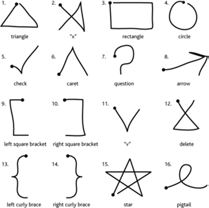

# Interaction Gestuelle : $1/$N Recognizer
## Objectifs
L’objectif du TP est de coder et d’étendre un moteur de reconnaissance de gestes.

Nous détaillerons tout d’abord l’algorithme du *[$1 Recognizer](https://depts.washington.edu/acelab/proj/dollar/index.html)*.

L’objectif est d’ensuite de coder une extension du *$1 Recognizer* *($N Multistroke Recognizer*) et de la connecter sur le [bus ivy](github.com/truillet/ivy) que nous pourrons ensuite réutiliser dans notre application multimodale.

## Documents de référence utilisés
* https://depts.washington.edu/aimgroup/proj/dollar/
Explication du projet, exemple de *$1 Recognizer* à tester, des exemples de code
* https://faculty.washington.edu/wobbrock/pubs/uist-07.01.pdf
**Publication :** Wobbrock, J.O., Wilson, A.D. and Li, Y. (2007). Gestures without libraries, toolkits or training: A $1 recognizer for user interface prototypes. Proceedings of the ACM Symposium on User Interface Software and Technology (UIST '07). Newport, Rhode Island (October 7-10, 2007). New York: ACM Press, pp. 159-168.
* https://faculty.washington.edu/wobbrock/pubs/gi-10.02.pdf
**Publication :** Anthony L., Wobbrock J.O (2010). A Lightweight Multistroke Recognizer for User
Interface Prototypes. Proceedings of Graphics Interface 2010. Ottawa, Ontario (May 31-June 2, 2010), pp. 245-252

## Le $1 Recognizer
L’implémentation d’un moteur de reconnaissance de gestes nécessite normalement des  connaissances avancées en apprentissage. Pour un concepteur en IHM, il est donc difficile d’implémenter la reconnaissance de gestes spécifiques.

L’objectif du projet *$1 Dollar Recognizer* est de permettre le codage d’un moteur de reconnaissance de  gestes dans différents langages, sans  que le développeur ait besoin d’avoir des connaissances dans l’apprentissage. Il a été démontré que l’algorithme détecte les gestes avec un taux proche d’algorithmes plus complexes.

La  Figure 1 montre les gestes (non ambigus) reconnus par l’algorithme.
Vous pouvez tester le moteur de reconnaissance sur le site proposé par le projet (voir plus haut).

*Figure 1 : Gestes reconnus par le One Dollar Recognizer*

L’article décrit quant à lui les principes de l’algorithme.
En résumé, le geste de l’utilisateur est une trace de *Points Candidats* pour lesquels il faut trouver le modèle (*Template*) qui ressemblent le plus à cette trame. Dans la suite de cet énoncé on parlera de modèles (= *template*) et trace (= *candidate*).
L’algorithme est indépendant de la façon comment le geste est effectué (avec la souris, sur une surface tactile, ...) mais le hardware et les spécificités de l’utilisateur déterminent la résolution des points, etc.

Par conséquent, il faut compenser ces différences. L’algorithme procède en plusieurs étapes (décrit sur pages 3 à 5 de l’article). Les étapes 1 à 3 s’appliquent aux modèles ainsi qu’aux traces :
1. *Resample* de la trace : le nombre de points par trace dépend du hardware, logiciel et de la vitesse de l’utilisateur à la saisie. Dans une première étape on fait un ré-échantillonnage pour que les points sont  équidistants sur la trace et correspondent au nombre de points dans le modèle. Un nombre de points N entre *32 et 256* aurait donné des bons résultats.

*Figure 2 : Exemples de ré-échantillonnage*

2. *Rotation* : tourner la trace pour que l’angle entre le centre et le premier point se trouve à 0° (à droite, voir Figure 3).

*Figure 3 : Rotation de la trace*

3.  *Redimensionner  et  décaler* : la trace est ensuite redimensionnée à la taille d’un carré de référence (les proportions de la trace originale ne sont donc pas respectées). Ensuite le centre de la trace est placé à la coordonnée (0,0).

4.  *Trouver le meilleur angle pour obtenir le meilleur score* : on calcule la distance moyenne entre la trace et les différents modèles avec la formule suivante :

$d_i = {{\sum_{k=1}^N {\sqrt{{(C[k]_x-T_i[k]_x})^2 +{(C[k]_y-T_i[k]_y})^2} }} \over N}$

Le modèle ayant la plus petite distance est le modèle retenu. Il est de plus possible de convertir cette distance dans un score de reconnaissance (voir article page 4). Il est aussi éventuellement nécessaire de faire une rotation plus précise (voir page 5 de l’article).
L’article fournit enfin en annexe (page 10) le pseudo-code de l’algorithme.

## Les grandes étapes à suivre :
1. Comprendre l’algorithme décrit sur cet énoncé et sur les pages 3 à 5 de l’article
2. Récupérer le code Procesing *OneDollarIvy* ici : https://github.com/truillet/OneDollarIvy ou celui en python là : https://github.com/truillet/upssitech/blob/master/SRI/5A/IHM/TP/Code/OneDollarIvy.zip , le tester.
3. A  partir de l’exemple fourni, programmer l’algorithme *$N Multistroke Recognizer* (pseudo-code ici :  https://depts.washington.edu/acelab/proj/dollar/ndollar.pdf) dans le langage de votre choix.
4. Programmer un module afin de permettre d’ajouter de nouveaux gestes au dictionnaire de gestes reconnus.
5. Intégrer ces modifications dans une application qui se connecte au [bus ivy](github.com/truillet/ivy).  Déterminer  les messages à envoyer sur le bus.
6. (*optionnel*) Intégrer votre travail de façon de permettre d’appliquer cette reconnaissance de
gestes directement sur un élément de visualisation (widget).
7. (*optionnel*) Intégrer votre reconnaissance de gestes avec la Leap Motion
(https://www.ultraleap.com/product/leap-motion-controller) par exemple (*SDK* : https://developer.leapmotion.com).

Il n’y a pas de rendu attendu, mais si l’application fonctionne et est intégrée dans le projet multimodal, elle sera comptée comme **bonus** pour la note de projet à venir.
